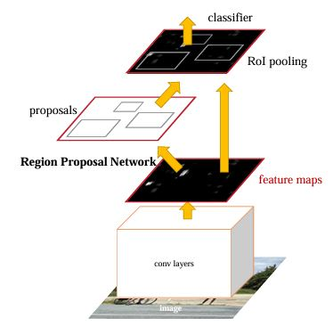
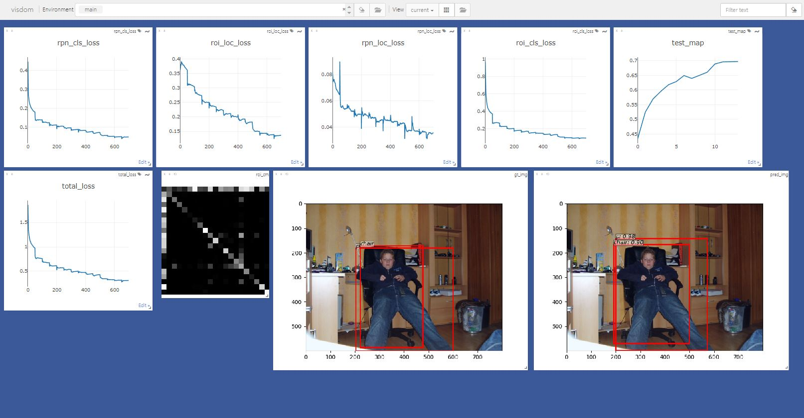

# Faster-RCNN 
**Faster R-CNN**: Towards Real-Time Object Detection with Region Proposal Networks(ICCV 2015) 리뷰

## 기존 방법의 문제점
기존 RCNN 모델은 Selective search algorithm을 통해 region proposal을 추출하기 때문에 학습 및 Detection 속도가 느리며 Detection 과정이 end to end로 이루어지지 않음</br>

## 문제점 해결
Faster RCNN은 Detection 하고자 하는 물체에 대한 후보 영역을 추출하는 네트워크인 Region Proposal Network(PRN)을 도입하여 기존의 문제점을 해결하였음</br>
PRN은 객체의 영역을 보다 정확하게 추출할 수 있도록 다양한 크기의 **Anchor box**(bbox)를 도입하여, 해당 영역을 RCNN 네트워크에 전달하여 객체의 클래스와 **Anchor box**의 위치를 Prediction함

기존 방법은 고정된 크기의 patch 사이즈를 사용하여 이미지를 sliding 하며 해당 위치의 patch로부터 객체를 탐지함</br>
이런 방법은 모든 객체가 유사한 사이즈를 갖고 있다는 가정 아래에 수행하는 것으로, 객체의 크기가 서로 다른 경우에는 객체를 정확히 탐지하기 어려움</br>
PRN은 patch마다 k개의 **Anchor box**를 정의하여 사용함으로써 문제를 해결함</br>
**Anchor box**는  scale과 ratio factor에 따라 다양한 크기의 bounding box를 다룰 수 있음</br>
다양한 **Anchor box** 중에서 Non-Maximum Suppression(NMS)을 통해 다양한 bounding box에서 confidence score와 IoU score를 계산하여 가장 객체를 잘 담고 있는 box를 선정함</br>
* 이때 IoU score가 일정값 이하로 낮다면, 다른 오브젝트로 구분하여 Instance Detection이 가능함

### 학습구조
전체 학습 과정은 아래와 같음

<p align='center'>
    
</p>

1. 입력 이미지로부터 featuer map을 추출함
2. 추출한 feature map은 PRN을 통과해 객체에 대하여 적절한 **Anchor box**를 계산함
3. 1)과 2)의 결과물에 ROI Pooing을 수행하여 모두 같은 크기의 feature map으로 변형함
4. RCNN 네트워크를 통해 해당 Feature map에 대한 Class와 Bounding box 위치를 계산함

## 학습
### 학습환경
```
OS : LINUX 20.04
CPU : Intel(R) Xeon(R) Silver 4214R CPU @ 2.40GHz
GPU : NVIDIA RTX A6000(VRAM 48G)
RAM : 128G
```

학습 결과는 다음의 사진과 같이 출력되었음 </br>
하단에 2개의 RGB Image가 있는데 왼쪽이 Ground Truth 오른쪽이 Predict한 결과임</br>
Ground Truth와 같이 사람과 의자를 잘 검출한 것을 볼 수 있음</br>

<p align='center'>
    
</p>

기타 예제는 .ipynb 파일을 참고 [예제1](plot_image_example.ipynb) [예제2](demo.ipynb)

## 참고
1. Faster-RCNN paper [[arxiv](https://arxiv.org/abs/1506.01497)]
2. chenyuntc의 github [[page](https://github.com/chenyuntc/simple-faster-rcnn-pytorch.git)]

3. sangnekim의 github [[page](https://github.com/sangnekim/faster-rcnn-for-studying)]
