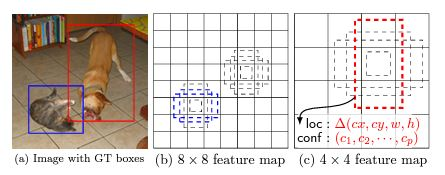
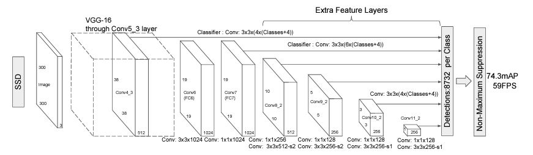

# SSD
**SSD**: Single shot multibox detector(2015) 리뷰

## 기존 방법의 문제점
Faster RCNN의 경우에는 Anchor box의 scale, ratio factor에 따라 크기가 결정되기 때문에 Flexibility가 떨어짐

## 문제점 해결
SSD는 일종의 Faster RCNN의 개선된 모델이라고 할 수 있음</br>
Pre-trained VGG 모델과 CNN 기반의 **Extra Feature Layers**를 구성함으로써 **Feature Pyramid** 방식을 통해 feature map의 크기를 조절하여 문제를 해결함</br>
VGG 모델의 Fully Connected Layer를 제외하여 입력 이미지에 대한 feature map을 생성함</br>
생성된 featur map은 **Extra Feature Layers**를 통해 크기가 점점 작아지며, 다양한 크기의 feature map를 생성할 수 있음</br>
다양한 크기의 **feature map**과 **bounding box**를 통해 다양한 크기의 객체를 탐지할 수 있음

<p align='center'>
    
</p>

bounding box의 크기는 **Extra Feature Layers**를 통과하는 **feature map**의 개수 $m$, scale factor($s_{min}$, $s_{max}$)로 결정됨</br>

<center>
$s_k = s_{min} + \frac{s_{max} - s_{min}}{m - 1} (k - 1), k \in [1, m]$
</center></br>


SSD의 학습 구조는 다음과 같음

<p align='center'>
    
</p>

1. 입력 이미지를 입력으로 VGG 모델을 통해 feature map을 생성하여 **Extra Feature Layers**로 전달함</br>
2. **Extra Feature Layers**는 입력되는 feature map의 채널 수와 동일한 3x3 filter를 사용하여 feature를 추출하며, 각 위치에서 k개의 **bounding box** 집합을 생성함</br>
3. 이후, Non-Maximum Suppression(NMS) 방법을 통해 객체를 잘 표현하고 있는 bounding box를 계산함</br>

## 학습
### 학습환경
```
OS : LINUX 20.04
CPU : Intel(R) Xeon(R) Silver 4214R CPU @ 2.40GHz
GPU : NVIDIA RTX A6000(VRAM 48G)
RAM : 128G
```

## 참고
1. SSD paper [[arxiv](https://arxiv.org/abs/1512.02325)]
2. amdegroot의 github [[page](https://github.com/amdegroot/ssd.pytorch/tree/master?tab=readme-ov-file)]