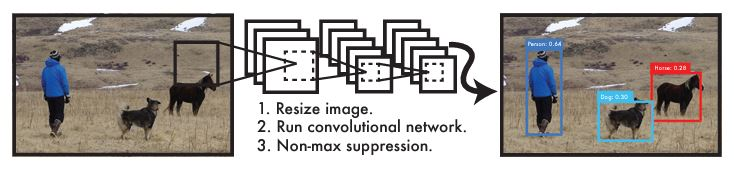
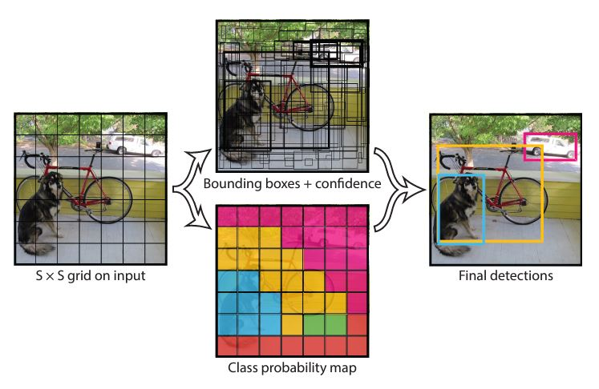
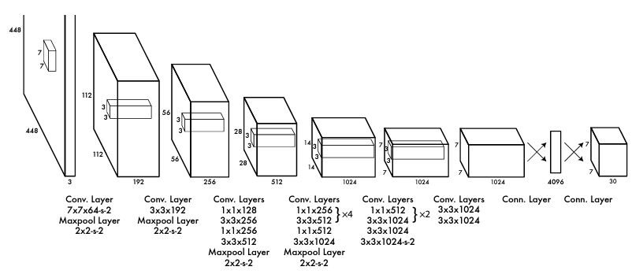
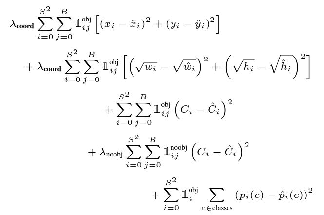

# YOLO
**YOLO** : You Only Look Once: Unified real-time object detection(2016 CVPR) 리뷰

## YOLO의 Object Detection 방법
YOLO는 아래의 단계를 거쳐 bounding box를 검출할 수 있음

<center>
    
</center>

1. Resize image
2. 컨볼루션 네트워크 통과
3. non maximum suppression 수행
</br>

## Method
이전의 Object Detection은 bounding box마다 해당 객체가 어떤 클래스에 속하는지를 추론하여 검출하였음</br>

YOLO는 학습 과정에서 **Grid based approach**를 도입하여 기존과는 **다른 방법(bounding box + Class probability map)** 으로 Object Detection을 수행함 </br>

<center>
    
</center>

이미지를 그리드로 쪼개 하나의 그리드마다 2개의 bounding box 추론하여,
해당 box안에서 객체 존재 여부에 대한 confidence를 함께 학습함</br>
각 그리드에서 생성된 bounding box가 객체를 얼마나 포함하고 있는지를 계산하여 Confidence score를 매김
$$Confidence = Pr(Object) \times IoU$$
모델은 오브젝트 전체에 대한 classfication을 수행하며 학습하는 것이 아닌 특정 오브젝트에 대해 각 class가 얼마나 나타날 수 있는지($Pr(Class_i | Object)$)를 **Class probability map**으로 나타냄</br>
이미지에서 객체를 예측할 경우에는 생성된 bounding box와 **Class probability map**을 사용하여 해당 객체의 클래스를 결정함
$$Pr(Class_i|Object) \times Pr(Object) \times IoU = Pr(Class_i) \times IoU$$

### 학습구조
<center>
    
</center>

YOLO 모델의 구조는 GoogleNet를 변형하여 사용하였으며, 448x448 크기의 이미지를 7x7의 그리드 형태로 축소시켜 학습을 진행함</br></br>
최초 448x448 크기의 입력 데이터는 feature map를 추출하며 7x7 크기의 그리드로 축소되며, Classifier를 거쳐 입력 이미지에 대한 object detection 결과를 출력함</br>

축소된 그리드에서 1칸이 담은 정보는 bounding box 2개의 구성성분($x, \ y, \ w, \ h$)와 confidence score(10채널) 그리고 20개의 Class에 대한 Classification 정보(20채널)을 갖고 있음

따라서, 7x7 크기의 그리드에 각각의 칸은 2개의 bounding box를 갖고 있으며, 총 98개의 box가 생성되며, Non-maximum suppression을 수행하여 최종 box를 결정함

### Loss 함수
<center>
    
</center>

가장 위의 2줄은 bounding box의 x,y 좌표 그리고 width, height에 대한 Loss를 계산하는 식이며, 다음 2줄은 객체와 배경에 대한 confidence score를 계산하는 식</br>
마지막 줄은 예측한 클래스와 실제 클래스를 비교하는 식

## 학습
### 학습환경
```
OS : LINUX 20.04
CPU : Intel(R) Xeon(R) Silver 4214R CPU @ 2.40GHz
GPU : NVIDIA RTX A6000(VRAM 48G)
RAM : 128G
```

## 참고
1. YOLO paper [[CVPR](https://www.cv-foundation.org/openaccess/content_cvpr_2016/html/Redmon_You_Only_Look_CVPR_2016_paper.html)]